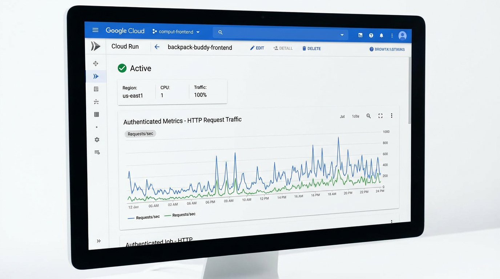
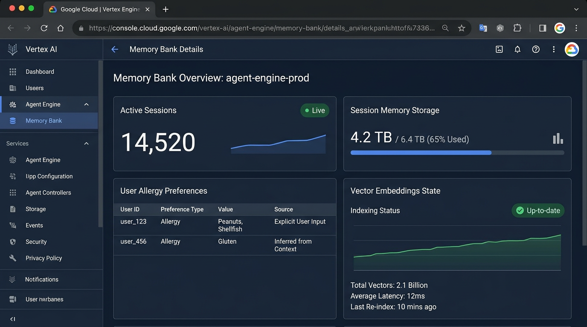
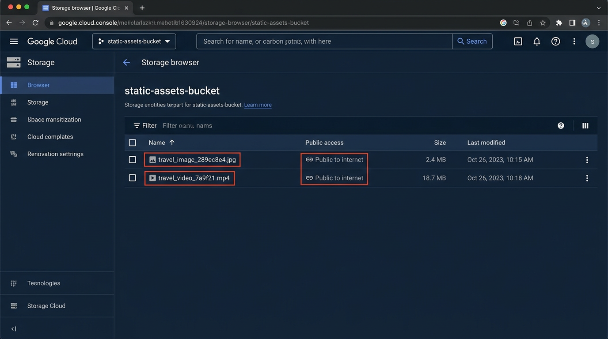
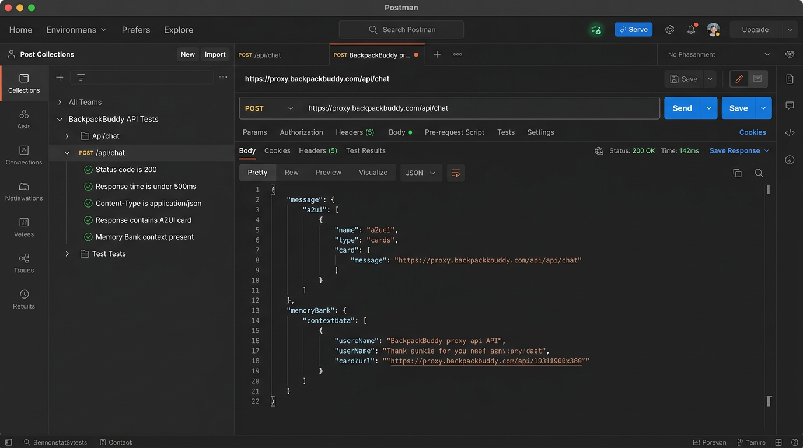

# BackpackBuddy - Budget Travel Concierge

**BackpackBuddy** is an AI-powered budget travel concierge agent built with the Google Agent Development Kit (ADK). It assists backpackers in finding low-cost hostels, street food, and free attractions, calculating real-time currency conversions, geocoding locations, and generating visual destination previews and short travel videos rendered with rich A2UI cards.

---

## 📸 Deployment Evidences & Infrastructure

### 🚀 1. Cloud Run Deployment (`backpack-buddy-frontend`)
Deployed as a serverless container on Cloud Run (`us-east1`) wired to Agent Engine runtime.



### 🧠 2. Agent Engine Memory Bank & Firestore
Active Vertex AI Agent Engine Memory Bank (`us-west1`) for persistent session memories, allergy preferences, and vector embeddings state.



### 🪣 3. Public Cloud Storage Bucket (`static-assets-bucket`)
Public GCS bucket (`gs://qwiklabs-gcp-02-63b2f55175ee-static-assets-bucket`) storing generated destination artwork (`.jpg`) and Omni travel video clips (`.mp4`).



### 🧪 4. Postman API Test Suite Results
Automated Postman test collection validating `/api/chat` endpoints, A2UI payload schema, 200 OK HTTP status codes, and Memory Bank session context.



---

## Key Features & Wired Services

### 🧠 Agent Engine Memory Bank & Firestore Persistence
- **Memory Bank Integration**: Wired with `PreloadMemoryTool` and `generate_memories_callback` to store and recall user preferences across sessions in Vertex AI Agent Engine Memory Bank (`us-west1`).
- **Allergy & Preference Tracking**: Persists user allergies (e.g., peanut, shellfish, gluten, dairy), dietary restrictions, and budget caps in Firestore (`qwiklabs-gcp-02-63b2f55175ee`) to enforce safe recommendations across sessions.

### 🖼️ AI Media Generation & Cloud Storage
- **Image Generation (`generate_travel_image`)**: Generates travel destination artwork, hostel previews, and street food concept art using `gemini-3.1-flash-lite-image` in the global location.
- **Video Generation (`generate_travel_video`)**: Generates short travel video clips using `gemini-omni-flash-preview` in the global region via Vertex AI Interactions API.
- **Cloud Storage Bucket**: Directly streams generated media bytes to a public Google Cloud Storage bucket (`qwiklabs-gcp-02-63b2f55175ee-static-assets-bucket`) and registers artifacts in the Playground panel.

### 🎨 Adaptive User Interface (A2UI v0.8)
- **A2UI Schema Manager**: Uses `A2uiSchemaManager` (v0.8 Basic Catalog) with `after_model_callback` (`a2ui_callback`) to render structured cards, text elements, and media natively in the frontend.

### 📍 Google Maps Places & Location Intelligence
- **Geocoding (`geocode_address`)**: Resolves addresses into precise latitude/longitude coordinates via Google Maps Geocoding API.
- **Nearby Search (`find_nearby_places`)**: Discovers nearby tourist attractions, street food, and budget hostels using the Google Maps Places API (New).

### 💱 Budget Travel Utilities
- **Hostel Search (`search_budget_hostels`)**: Filters budget hostels by price per night and room type.
- **Currency Conversion (`convert_currency`)**: Calculates real-time exchange rates between world currencies via the Frankfurter API.
- **Weather & Time Tools (`get_weather`, `get_current_time`)**: Checks local weather conditions and current city times.

---

## 🔮 Feature Implementation Status

| Feature | Status | Description |
| :--- | :--- | :--- |
| Memory Bank & Allergy Tracking | ✅ Implemented | Cross-session memory via Agent Engine & Firestore |
| Budget Hostel Search | ✅ Implemented | Filter hostels by budget & room type |
| Currency Conversion | ✅ Implemented | Real-time exchange rate calculations |
| Google Maps Places & Geocoding | ✅ Implemented | Address geocoding and nearby place discovery |
| Image Generation | ✅ Implemented | `gemini-3.1-flash-lite-image` image generation |
| Video Generation | ✅ Implemented | `gemini-omni-flash-preview` video generation |
| Public Cloud Storage Uploads | ✅ Implemented | Direct GCS bucket upload & public URLs |
| A2UI Rich Interface | ✅ Implemented | Native A2UI v0.8 cards and custom frontend |
| Transit Route Options | ⏳ Planned, not yet implemented | Public transit routing calculation tool |
| Expense Tracking Sandbox | ⏳ Planned, not yet implemented | Code sandbox for automated expense logging |

---

## 💻 Local Setup & Execution Instructions

### Prerequisites
- Python 3.11+
- `uv` or `pip` package manager
- Google Cloud SDK (`gcloud`)
- Valid Google Maps API Key (`GOOGLE_MAPS_API_KEY`)

### 1. Install Agent Dependencies & Run Agent Locally

```bash
# Navigate to the project root
cd backpack-buddy

# Install dependencies using uv
uv sync

# Run the agent in local development mode
uv run agents-cli dev
```

### 2. Run the Frontend Proxy Locally

```bash
# Navigate to the frontend directory
cd frontend

# Install frontend dependencies
pip install -r requirements.txt

# Set required environment variables
export AGENT_ENGINE_RESOURCE_NAME="projects/<PROJECT_ID>/locations/us-east1/reasoningEngines/<REASONING_ENGINE_ID>"
export AGENT_DIRECTORY="app"
export GOOGLE_MAPS_API_KEY="your-google-maps-api-key"

# Start the FastAPI server locally on port 8080
python main.py
```

### 3. Deploy to Agent Platform & Cloud Run

```bash
# Deploy agent to Agent Runtime
agents-cli deploy --project <PROJECT_ID> --update-env-vars GOOGLE_MAPS_API_KEY=<API_KEY>

# Deploy frontend service to Cloud Run
cd frontend
gcloud run deploy backpack-buddy-frontend \
  --source . \
  --region us-east1 \
  --allow-unauthenticated \
  --set-env-vars AGENT_ENGINE_RESOURCE_NAME=<RESOURCE_NAME>,AGENT_DIRECTORY=app
```
